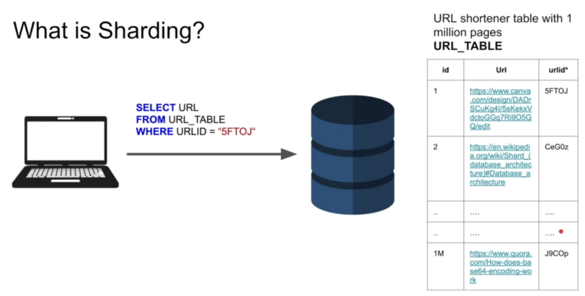
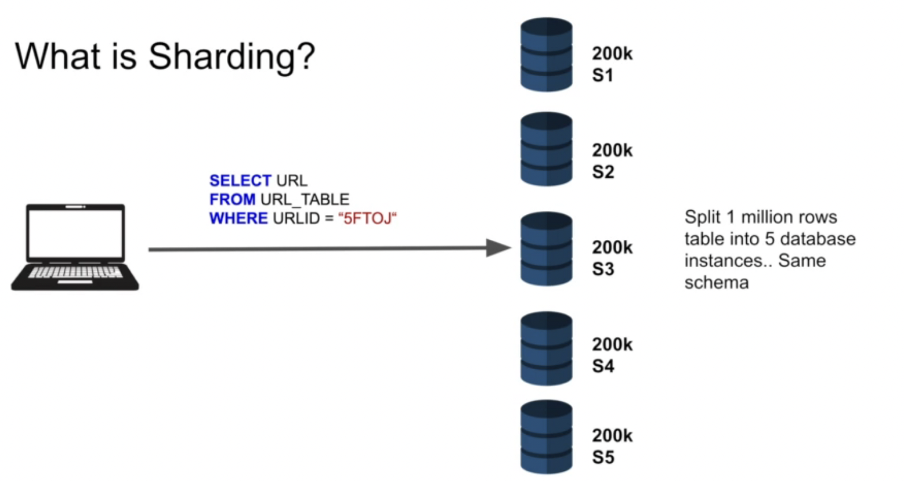
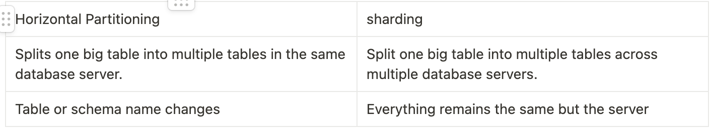

# Sharding

## Description

- Database sharding is the process of segmenting data into partitions that are spread over multiple database instances. This is mostly done when you have huge amounts of data and you want to reduce query time and scale.

## What is Database sharding?

- As you can see in the above example of a url shortener, our urls may reach to millions or billions of rows and even though we have an index on the shorturl it still becomes hard to make fast queries when the number of rows is just so high.

- How do you know which server to query for “5fTOJ”?
  - via consistent hashing!

## Consistent Hashing

- Consistent hashing solves the “which database server should i run my query in to retrieve some data?” problem
- `hash_function(user_input) = database_server_id`
  - hash function could be `(user_input + 1) % (number of databases)` or any other function based on requirements.

## Horizontal Partitioning Vs Sharding

## Code example

- run `docker build -t pgshard .` to setup your first shard
